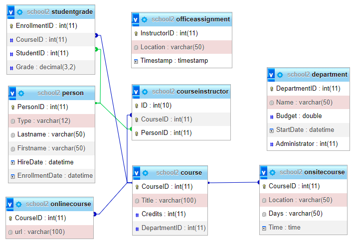

# Project 1 - Quản lý khóa học

/Java_(programming_language)-Logo.wine.png>)

 

## Thành viên nhóm

| STT |    MSSV    | Họ và tên             |
| :-: | :--------: | --------------------- |
|  1  | 3119410467 | Nguyễn Đức Minh Trung |
|  2  | 3119410420 | Hồ Tấn Thuận          |
|  3  | 3119410294 | Võ Hoàng Quỳnh Như    |
|  4  | 3119410308 | Trần Kim Phú          |
|  5  | 3119410439 | Minh Hiếu Calan Tog   |

## Yêu Cầu:

- Xây dựng theo mô hình 3 layer <br/>

## Database



## Thư Viện:

```
mysql-connector-java version 8.0.26
jcalendar-1.4
```

## Hướng dẫn cài đặt

Phần mềm chạy tốt trên nền tảng java version 18 với jdk version 18. với độ phân giải màn hình chuẩn của máy là > 1280x900 ( FullHD )


```
1. Tạo database "school2" và import file school2.sql vào phpadmin trên XAMPP .
```

```
2. Import tất cả các thư viện trong thư mục /libs/ .
```

```
3. Mở IDE NetBeans ( hoặc Eclipse ) để import project .
```

```
4. Buil project sau đó run application để sử dụng được chương trình .
```

## Tổng quan giao diện của phần mềm

<h3 align="center">Giao diện chính</h3><br>


